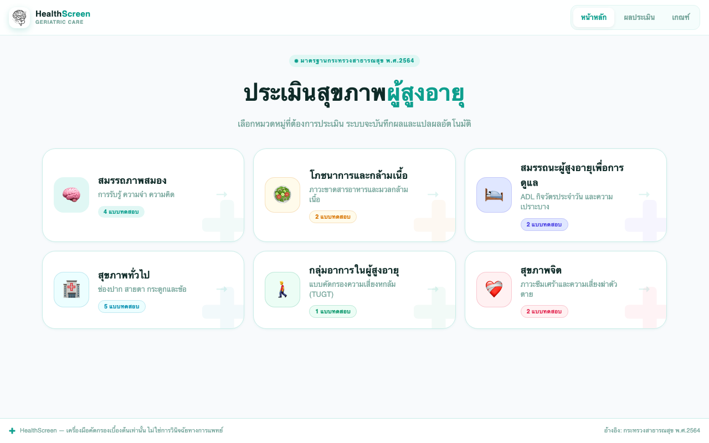
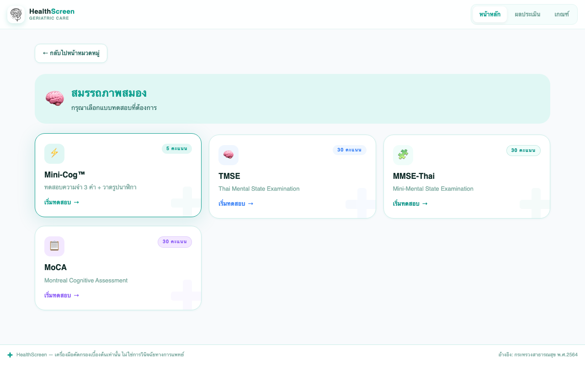
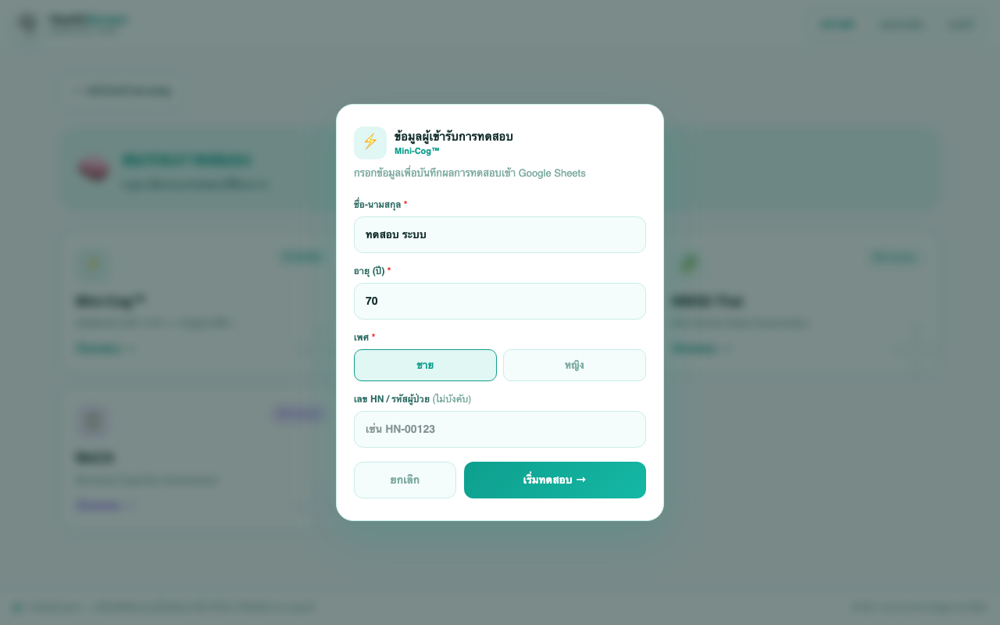
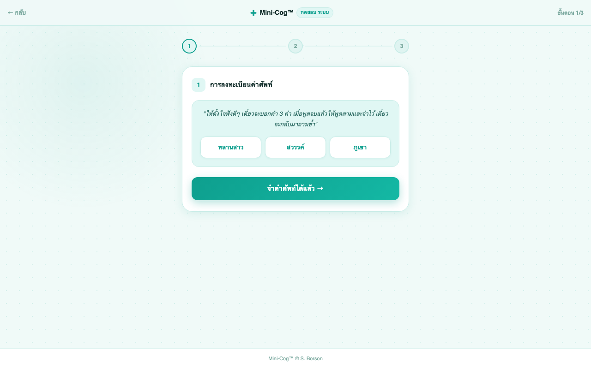
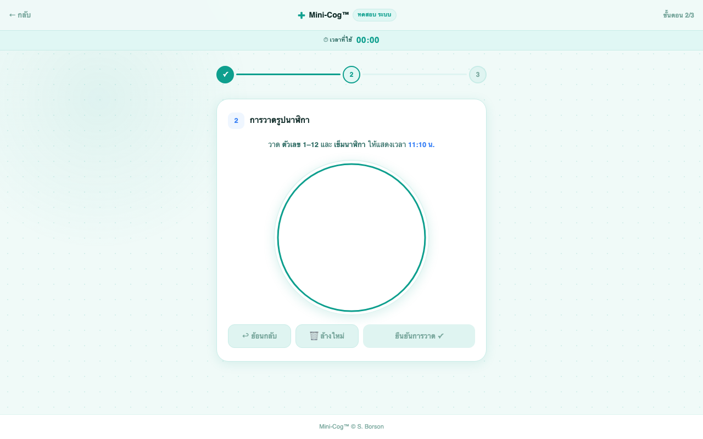
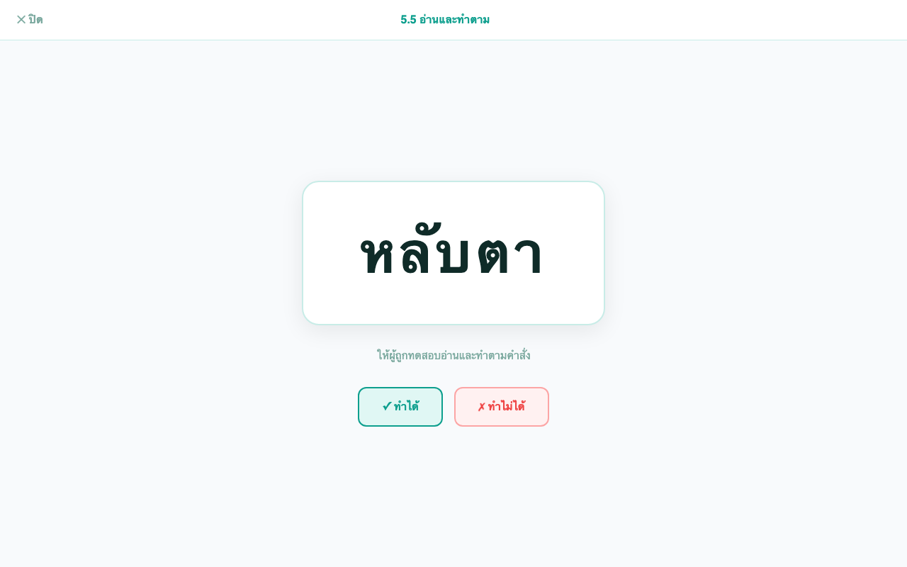
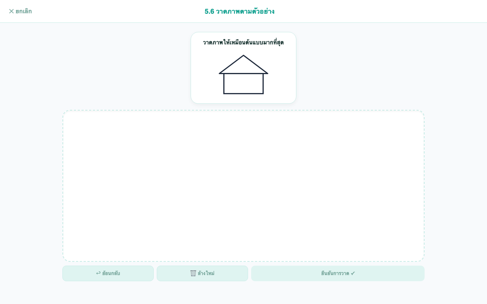
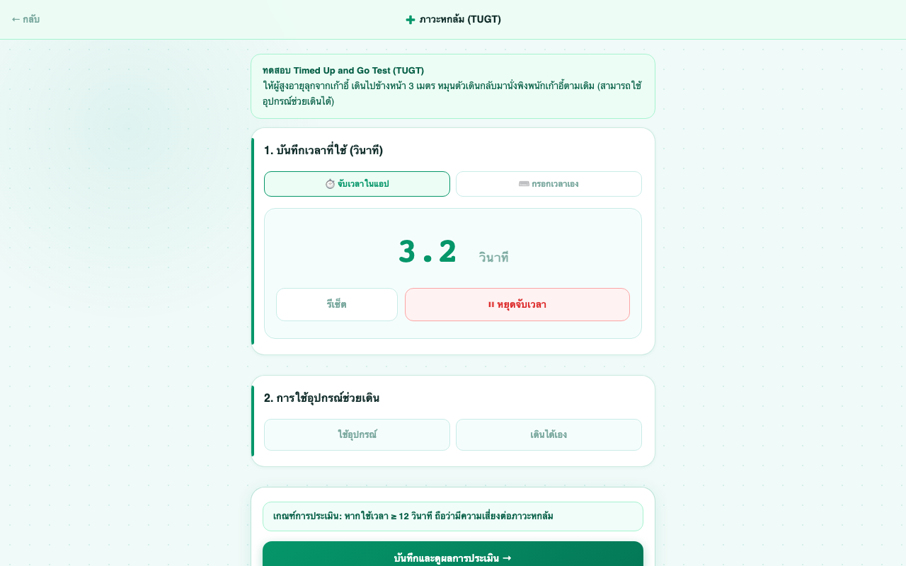
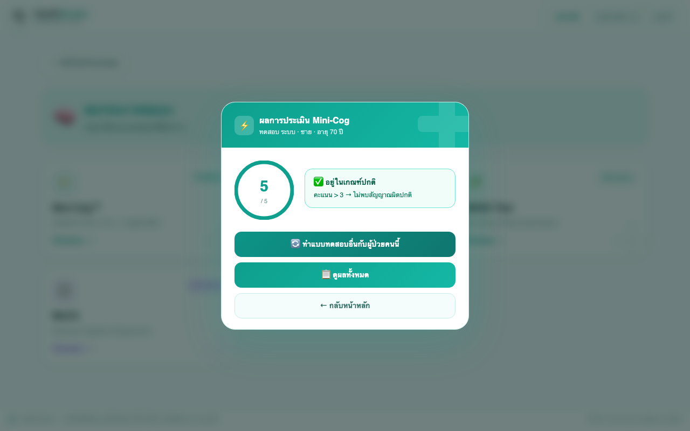
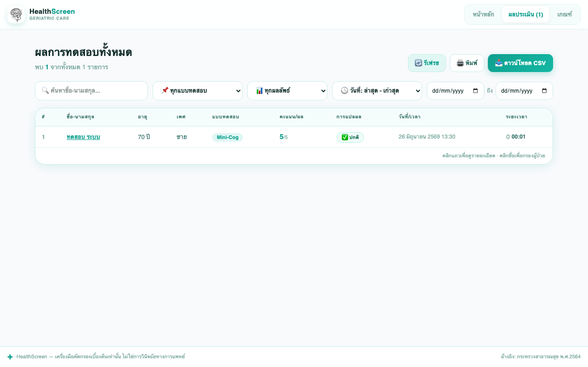

<!-- เปิดไฟล์ docs/MANUAL.docx เพื่อใช้งานคู่มือฉบับนี้ — ไฟล์นี้ (.md) คือต้นฉบับสำหรับแก้ไขข้อความ แทรกภาพ/แก้ไขแล้วสร้างไฟล์ Word ใหม่ได้ด้วยคำสั่ง: pandoc docs/MANUAL.md -o docs/MANUAL.docx -->

# 🩺 คู่มือการใช้งาน HealthScreen

คู่มือฉบับนี้สำหรับ **ผู้ใช้งานทั่วไป** (พยาบาล/บุคลากรสาธารณสุขที่ใช้แอปคัดกรองสุขภาพผู้สูงอายุ) อธิบายเฉพาะ **วิธีใช้งานแอปที่เปิดให้ใช้งานแล้ว** ไม่ครอบคลุมการติดตั้ง การตั้งค่า Google Sheets หรือการดูแลระบบ (ดูเรื่องเหล่านั้นได้ใน [README.md](../README.md))

---

## สารบัญ

1. [HealthScreen คืออะไร](#1-healthscreen-คืออะไร)
2. [เริ่มต้นใช้งาน](#2-เริ่มต้นใช้งาน)
3. [เมนูหลัก 3 แท็บ](#3-เมนูหลัก-3-แท็บ)
4. [ขั้นตอนการทำแบบทดสอบ (ภาพรวม)](#4-ขั้นตอนการทำแบบทดสอบ-ภาพรวม)
5. [กรอกข้อมูลผู้เข้ารับการทดสอบ](#5-กรอกข้อมูลผู้เข้ารับการทดสอบ)
6. [โหมดทดสอบต่อเนื่องกับผู้ป่วยคนเดิม](#6-โหมดทดสอบต่อเนื่องกับผู้ป่วยคนเดิม)
7. [ตัวอย่างการทำแบบทดสอบแบบละเอียด](#7-ตัวอย่างการทำแบบทดสอบแบบละเอียด)
8. [ตารางสรุปแบบทดสอบที่เหลือ](#8-ตารางสรุปแบบทดสอบที่เหลือ)
9. [การอ่านผลการประเมิน](#9-การอ่านผลการประเมิน)
10. [การบันทึกผล](#10-การบันทึกผล)
11. [การใช้งานแท็บ "ผลประเมิน"](#11-การใช้งานแท็บ-ผลประเมิน)
12. [แท็บ "เกณฑ์"](#12-แท็บ-เกณฑ์)
13. [คำถามที่พบบ่อย](#13-คำถามที่พบบ่อย)
14. [ข้อจำกัดความรับผิดชอบ](#14-ข้อจำกัดความรับผิดชอบ)

---

## 1. HealthScreen คืออะไร

HealthScreen เป็นเครื่องมือคัดกรองสุขภาพผู้สูงอายุแบบดิจิทัล รวบรวมแบบทดสอบคัดกรอง 14 ชุด (แสดงผลเป็น 16 การ์ดแบบทดสอบใน 6 หมวดหมู่ — บางชุด เช่น "โรคกระดูกและข้อ" แยกเป็นการ์ดย่อยหลายใบคือ OSTA / FRAX / ข้อเข่าเสื่อม) ตามมาตรฐานการคัดกรองและประเมินสุขภาพผู้สูงอายุ กรมการแพทย์ กระทรวงสาธารณสุข พ.ศ. 2564

> ⚠️ **HealthScreen เป็นเครื่องมือคัดกรองเบื้องต้นเท่านั้น ไม่ใช่การวินิจฉัยทางการแพทย์** ผลที่ได้ควรให้บุคลากรทางการแพทย์ที่เกี่ยวข้องพิจารณาประกอบการดูแลผู้ป่วยต่อไป

## 2. เริ่มต้นใช้งาน

- เปิดลิงก์ของแอปในเบราว์เซอร์ (คอมพิวเตอร์ แท็บเล็ต หรือมือถือก็ได้ — หน้าจอถูกออกแบบให้ใช้งานสะดวกบนแท็บเล็ตที่ใช้ในคลินิก)
- **ไม่ต้องสมัครสมาชิกหรือเข้าสู่ระบบ** เปิดมาใช้งานได้ทันที

## 3. เมนูหลัก 3 แท็บ

| แท็บ | ใช้ทำอะไร |
|---|---|
| **หน้าหลัก** | เลือกหมวดหมู่และแบบทดสอบที่จะทำกับผู้ป่วย |
| **ผลประเมิน** | ดูผลทดสอบที่ทำไปแล้วทั้งหมด ค้นหา กรอง พิมพ์ และดาวน์โหลดเป็น CSV (ตัวเลขในวงเล็บข้างแท็บ คือจำนวนผลทดสอบที่มีอยู่) |
| **เกณฑ์** | ดูเกณฑ์การให้คะแนนและการแปลผลของทุกแบบทดสอบ (ไว้อ้างอิงเมื่อไม่แน่ใจว่าคะแนนแบบไหนถือว่าผิดปกติ) |

*📸 คำอธิบายภาพ: หน้าหลักของแอป แสดงการ์ดหมวดหมู่ 6 หมวดให้เลือก*

## 4. ขั้นตอนการทำแบบทดสอบ (ภาพรวม)

ทุกแบบทดสอบใช้ขั้นตอนเดียวกันนี้:

1. ที่แท็บ **หน้าหลัก** เลือกหมวดหมู่ (เช่น "สมรรถภาพสมอง")
2. เลือกแบบทดสอบที่ต้องการจากการ์ดที่แสดงขึ้น (เช่น "TMSE")
3. กรอกข้อมูลผู้เข้ารับการทดสอบในกล่องที่เด้งขึ้นมา แล้วกด **"เริ่มทดสอบ →"**
4. ทำแบบทดสอบไปตามขั้นตอนที่แอปแสดง (คำถาม Yes/No, กรอกตัวเลข, วาดภาพ, จับเวลา ฯลฯ ขึ้นอยู่กับแบบทดสอบ)
5. เมื่อทำครบ แอปจะสรุปผลให้ทันทีและบันทึกผลให้อัตโนมัติ
6. เลือกต่อได้ว่าจะทำแบบทดสอบอื่นกับผู้ป่วยคนเดิม ดูผลทั้งหมด หรือกลับหน้าหลัก

*📸 คำอธิบายภาพ: หลังเลือกหมวดหมู่ จะเห็นการ์ดแบบทดสอบให้เลือก*

## 5. กรอกข้อมูลผู้เข้ารับการทดสอบ

ก่อนเริ่มทุกแบบทดสอบ จะมีกล่อง **"ข้อมูลผู้เข้ารับการทดสอบ"** ให้กรอก:

| ช่อง | จำเป็นหรือไม่ | คำอธิบาย |
|---|---|---|
| ชื่อ-นามสกุล | จำเป็น | ชื่อผู้เข้ารับการทดสอบ |
| อายุ (ปี) | จำเป็น | ตัวเลข 1–120 |
| เพศ | จำเป็น | เลือก "ชาย" หรือ "หญิง" โดยกดปุ่ม |
| เลข HN / รหัสผู้ป่วย | ไม่บังคับ | เลขประจำตัวผู้ป่วยของโรงพยาบาล/คลินิก (เช่น `HN-00123`) ใส่ไว้เพื่อให้ค้นหาและอ้างอิงผลย้อนหลังของผู้ป่วยคนนี้ได้ง่ายขึ้นในแท็บ "ผลประเมิน" — ถ้าไม่มีหรือไม่ทราบ ปล่อยว่างไว้ได้ |

*📸 คำอธิบายภาพ: กล่องกรอกชื่อ/อายุ/เพศ/HN ก่อนเริ่มทดสอบ*

กดปุ่ม **"เริ่มทดสอบ →"** เพื่อเข้าสู่แบบทดสอบ หรือ **"ยกเลิก"** เพื่อกลับไปเลือกแบบทดสอบใหม่

## 6. โหมดทดสอบต่อเนื่องกับผู้ป่วยคนเดิม

หลังทำแบบทดสอบแรกเสร็จ ถ้ากด **"🔄 ทำแบบทดสอบอื่นกับผู้ป่วยคนนี้"** แอปจะจำข้อมูลผู้ป่วยไว้ และที่หน้าหลักจะมีแถบสีเขียว **"🔄 โหมดทดสอบต่อเนื่อง"** แสดงชื่อ/เพศ/อายุของผู้ป่วยคนนั้นค้างอยู่ — เลือกแบบทดสอบต่อไปได้โดย **ไม่ต้องกรอกข้อมูลผู้ป่วยซ้ำ**

เมื่อต้องการเปลี่ยนไปทดสอบผู้ป่วยคนใหม่ ให้กด **"เปลี่ยนผู้ป่วย ×"** ที่มุมขวาของแถบนั้น

## 7. ตัวอย่างการทำแบบทดสอบแบบละเอียด

### 7.1 Mini-Cog™ (สั้นที่สุด — แนะนำดูตัวอย่างนี้ก่อน)

วัดความจำระยะสั้นและการรับรู้เชิงพื้นที่ คะแนนเต็ม 5 คะแนน ทำ 3 ขั้นตอน:

1. **การลงทะเบียนคำศัพท์** — แอปแสดงคำ 3 คำให้ผู้ทดสอบอ่านออกเสียงให้ผู้ป่วยฟังและให้พูดตาม เมื่อผู้ป่วยพูดตามแล้ว กด **"จำคำศัพท์ได้แล้ว →"**
2. **การวาดรูปนาฬิกา** — ให้ผู้ป่วยวาดรูปนาฬิกาพร้อมตัวเลขและเข็มบอกเวลาที่กำหนดบนผืนวาดในแอป จากนั้นให้คะแนน 0 หรือ 2 ตามความถูกต้อง
3. **การทดสอบความจำ** — ถามผู้ป่วยว่าจำคำ 3 คำจากขั้นตอนแรกได้หรือไม่ กดปุ่ม **"จำได้"** หรือ **"ลืม"** ทีละคำ
4. แอปแสดงผลรวมเป็นวงคะแนน /5 พร้อมแปลผลว่าอยู่ในเกณฑ์ปกติหรือมีแนวโน้ม Cognitive Impairment

*📸 คำอธิบายภาพ: ขั้นตอนฟังและจำคำศัพท์ 3 คำ (Mini-Cog)*

*📸 คำอธิบายภาพ: ขั้นตอนวาดรูปนาฬิกาบนผืนวาด (Mini-Cog)*

### 7.2 TMSE (Thai Mental State Examination)

แบบทดสอบสภาพสมอง 6 หมวด คะแนนเต็ม 30 คะแนน เป็นตัวอย่างแบบทดสอบที่มีโหมด **เต็มจอ** 2 จุด:

- หมวด 1–4 (เวลา/สถานที่, การจำคำ, สมาธิ, การคำนวณ) ตอบโดยกดปุ่ม Yes/No หรือกรอกตัวเลขตามที่แอปถาม
- หมวดที่ 5 (ภาษา) มี 2 ขั้นตอนที่เปิด **โหมดเต็มจอ**:
  - **5.5 อ่านและทำตาม** — กดปุ่ม **"🖥️ เริ่มทำ"** จะเปิดหน้าเต็มจอแสดงคำสั่งตัวใหญ่ (เช่น "หลับตา") ให้ผู้ป่วยอ่านและทำตาม จากนั้นกด **"✓ ทำได้"** หรือ **"✗ ทำไม่ได้"** หรือกด **"✕ ปิด"** มุมซ้ายบนเพื่อออกโดยไม่บันทึกคะแนน
  - **5.6 วาดภาพตามตัวอย่าง** — กดปุ่ม **"🖥️ เริ่มทำ"** จะเปิดหน้าเต็มจอพร้อมผืนวาดรูปขนาดใหญ่ ให้ผู้ป่วยวาดรูปตามต้นแบบที่แสดงไว้ด้านบน แล้วให้คะแนน 0/1/2 ตามความถูกต้อง หรือกด **"✕ ยกเลิก"** เพื่อออกโดยไม่บันทึกคะแนน
- หมวดที่ 6 (การระลึกความจำ) ถามซ้ำว่าจำ 3 คำจากหมวดที่ 2 ได้หรือไม่
- ผลสรุปแสดงคะแนนรวม /30 พร้อมคะแนนแยกแต่ละหมวด และแปลผล "✅ ผลการประเมินอยู่ในเกณฑ์ปกติ" (≥ 24 คะแนน) หรือ "⚠️ มีภาวะ Cognitive Impairment" (< 24 คะแนน)

*📸 คำอธิบายภาพ: โหมดเต็มจอ "5.5 อ่านและทำตาม" (TMSE)*

*📸 คำอธิบายภาพ: โหมดเต็มจอ "5.6 วาดภาพตามตัวอย่าง" (TMSE)*

### 7.3 แบบคัดกรองความเสี่ยงหกล้ม (TUGT — Timed Up and Go Test)

ตัวอย่างแบบทดสอบที่ใช้ **การจับเวลา** แทนการตอบคำถาม:

1. เลือกวิธีบันทึกเวลา: ปุ่ม **"⏱️ จับเวลาในแอป"** (ให้แอปจับเวลาจริง) หรือสลับไปกรอกเวลาที่จับด้วยนาฬิกาภายนอกเองในช่อง "เวลาที่ใช้ทั้งหมด (วินาที)"
2. ถ้าจับเวลาในแอป: ให้ผู้ป่วยลุกจากเก้าอี้ เดิน 3 เมตร แล้วเดินกลับมานั่งที่เดิม ระหว่างนี้กดปุ่ม **"▶️ เริ่มจับเวลา"** ตอนผู้ป่วยลุก และกด **"⏸ หยุดจับเวลา"** ตอนผู้ป่วยนั่งกลับที่เดิม (กด **"▶️ จับเวลาต่อ"** ได้ถ้าต้องจับต่อหลังหยุดชั่วคราว)
3. กดยืนยันเพื่อบันทึกผล — เกณฑ์: ใช้เวลา **< 12 วินาที** = การทรงตัวปกติ, **≥ 12 วินาที** = มีความเสี่ยงต่อภาวะหกล้ม

*📸 คำอธิบายภาพ: หน้าจับเวลาพร้อมปุ่มเริ่ม/หยุดจับเวลา (TUGT)*

## 8. ตารางสรุปแบบทดสอบที่เหลือ

แบบทดสอบอื่นๆ ใช้รูปแบบคล้ายตัวอย่างข้างต้น (ตอบคำถาม/กรอกคะแนน/วาดภาพ) ดูเกณฑ์การให้คะแนนแบบละเอียดของแต่ละแบบทดสอบได้ที่แท็บ **"เกณฑ์"** ในแอป:

| แบบทดสอบ | หมวดหมู่ | วัดอะไร | คะแนนเต็ม/ลักษณะ |
|---|---|---|---|
| MMSE-Thai 2002 | สมรรถภาพสมอง | สภาพสมองเบื้องต้น | 30 คะแนน (จุดตัดขึ้นกับระดับการศึกษา) |
| MoCA | สมรรถภาพสมอง | คัดกรองภาวะสมองเสื่อมระยะเริ่มต้น | 30 คะแนน |
| ภาวะโภชนาการ (MNA) | โภชนาการและกล้ามเนื้อ | ภาวะขาดสารอาหาร | แบบคัดกรอง 14 คะแนน, แบบเต็ม 30 คะแนน |
| มวลกล้ามเนื้อ (Modified MSRA-5) | โภชนาการและกล้ามเนื้อ | ความเสี่ยงภาวะมวลกล้ามเนื้อน้อย (Sarcopenia) | 5 ข้อ |
| กิจวัตรประจำวัน (ADL) | สมรรถนะผู้สูงอายุเพื่อการดูแล | ความสามารถทำกิจวัตรพื้นฐาน 10 ด้าน | 20 คะแนน |
| ความเปราะบาง (Frail Scale) | สมรรถนะผู้สูงอายุเพื่อการดูแล | ภาวะเปราะบาง | 5 ข้อ |
| สุขภาพช่องปาก | สุขภาพทั่วไป | ปัญหาช่องปาก 8 ด้าน | 8 รายการ |
| สุขภาวะทางตา | สุขภาพทั่วไป | ต้อกระจก/ต้อหิน/จอตาเสื่อม + Snellen Chart | คัดกรอง 5 รายการ + วัดระยะ/ใกล้ |
| OSTA Index | สุขภาพทั่วไป | ความเสี่ยงโรคกระดูกพรุน | คำนวณจากอายุและน้ำหนัก |
| FRAX Score | สุขภาพทั่วไป | โอกาสกระดูกหักใน 10 ปี | คำนวณจากปัจจัยเสี่ยงหลายข้อ |
| การคัดกรองข้อเข่าเสื่อม | สุขภาพทั่วไป | โรคข้อเข่าเสื่อมทางคลินิก | ปวดเข่า + อาการร่วม |
| ภาวะซึมเศร้า (2Q/9Q) | สุขภาพจิต | ภาวะซึมเศร้า | 2Q คัดกรอง → 9Q ประเมินความรุนแรง (27 คะแนน) |
| ความเสี่ยงฆ่าตัวตาย (8Q) | สุขภาพจิต | แนวโน้มการฆ่าตัวตาย | 8 ข้อ (น้ำหนักคะแนนไม่เท่ากัน) |

## 9. การอ่านผลการประเมิน

เมื่อทำแบบทดสอบครบ แอปจะแสดงกล่องสรุปผล ประกอบด้วย:

- **คะแนน** — แสดงเป็นวงคะแนน (เช่น 24/30) หรือเป็นวินาที (สำหรับ TUGT) หรือข้อความเฉพาะ (สำหรับบางแบบทดสอบ)
- **แถบแปลผล** — สีเขียว **"✅ อยู่ในเกณฑ์ปกติ"** หรือสีส้ม **"⚠️ พบสัญญาณความเสี่ยง"**
- ปุ่มดำเนินการต่อ:
  - **"🔄 ทำแบบทดสอบอื่นกับผู้ป่วยคนนี้"** — ทำแบบทดสอบถัดไปกับผู้ป่วยเดิมต่อ (ดูหัวข้อ 6)
  - **"📋 ดูผลทั้งหมด"** — ไปที่แท็บผลประเมิน
  - **"← กลับหน้าหลัก"** — กลับไปเลือกแบบทดสอบใหม่

*📸 คำอธิบายภาพ: กล่องสรุปผลพร้อมวงคะแนนและแถบแปลผล*

## 10. การบันทึกผล

- ผลทุกครั้งจะถูก **บันทึกไว้ในเครื่อง/เบราว์เซอร์ที่ใช้งานทันทีโดยอัตโนมัติ** ไม่ว่าจะเชื่อมต่อ Google Sheets ได้หรือไม่
- ถ้าระบบเชื่อมต่อกับ Google Sheets ไว้ จะเห็นข้อความ **"กำลังบันทึกไปยัง Google Sheets…"** ขึ้นที่มุมจอชั่วครู่ ตามด้วยข้อความแจ้งผลสำเร็จหรือไม่สำเร็จ

## 11. การใช้งานแท็บ "ผลประเมิน"

แท็บนี้แสดงผลทดสอบทั้งหมดที่บันทึกไว้ พร้อมเครื่องมือช่วยค้นหา:

- ช่องค้นหา **"🔍 ค้นหาชื่อ-นามสกุล..."**
- ตัวกรองแบบทดสอบ **"📌 ทุกแบบทดสอบ"**
- ตัวกรองผลลัพธ์ **"📊 ทุกผลลัพธ์" / "⚠️ พบปัญหา" / "✅ ปกติ"**
- ตัวเลือกการจัดเรียง — วันที่ (ล่าสุด/เก่าสุด), ชื่อ (ก–ฮ), อายุ (น้อย–มาก / มาก–น้อย)
- ตัวกรองช่วงวันที่ (จาก–ถึง)
- **คลิกที่แถวผลลัพธ์** เพื่อดูรายละเอียดคะแนนแยกตามหมวด
- **คลิกที่ชื่อผู้ป่วย** เพื่อกรองดูผลย้อนหลังทั้งหมดของผู้ป่วยคนนั้นโดยอัตโนมัติ
- ปุ่ม **"🔄 รีเฟรช"** (โหลดข้อมูลล่าสุดใหม่), **"🖨️ พิมพ์"**, **"📥 ดาวน์โหลด CSV"**

*📸 คำอธิบายภาพ: ตารางผลประเมินพร้อมช่องค้นหา/ตัวกรอง (แท็บ "ผลประเมิน")*

## 12. แท็บ "เกณฑ์"

แท็บนี้รวบรวมเกณฑ์การให้คะแนนและการแปลผลของแบบทดสอบทั้ง 14 ชุดไว้ในที่เดียว ใช้เป็นข้อมูลอ้างอิงเวลาทำแบบทดสอบหรืออ่านผลแล้วไม่แน่ใจว่าคะแนนระดับใดถือว่าปกติ/ผิดปกติ (เนื้อหาละเอียดอยู่ในแอปแล้ว คู่มือฉบับนี้จึงไม่คัดลอกซ้ำ)

## 13. คำถามที่พบบ่อย

**HN คืออะไร ต้องกรอกไหม?**
HN คือเลขประจำตัวผู้ป่วยของโรงพยาบาล/คลินิก เป็นช่องไม่บังคับ ใส่ไว้เพื่อให้ค้นหาผลย้อนหลังของผู้ป่วยคนเดียวกันได้ง่ายขึ้นเท่านั้น ถ้าไม่มีเลข HN จะปล่อยว่างไว้ก็ทำแบบทดสอบได้ตามปกติ

**"⚠️ พบสัญญาณความเสี่ยง" หมายความว่าอย่างไร?**
หมายถึงคะแนนของผู้ป่วยอยู่ในช่วงที่เกณฑ์มาตรฐานกำหนดว่าควรได้รับการดูแล/ส่งต่อเพิ่มเติม **นี่ไม่ใช่การวินิจฉัยโรค** เป็นเพียงการคัดกรองเบื้องต้น ควรให้แพทย์หรือบุคลากรที่เกี่ยวข้องประเมินซ้ำ

**ขึ้นข้อความว่าบันทึกไปยัง Google Sheets ไม่สำเร็จ ต้องทำอย่างไร?**
ผลการทดสอบยังถูกบันทึกไว้ในเครื่อง/เบราว์เซอร์ที่ใช้งานเรียบร้อยแล้ว และยังดูได้ตามปกติที่แท็บ "ผลประเมิน" ลองกด **"🔄 รีเฟรช"** อีกครั้ง หากเกิดขึ้นซ้ำๆ ให้แจ้งผู้ดูแลระบบของหน่วยงาน

**ปิดเบราว์เซอร์หรือแท็บกลางคันระหว่างทำแบบทดสอบจะเป็นอย่างไร?**
แบบทดสอบที่ทำไม่เสร็จจะไม่ถูกบันทึก ต้องเริ่มทำแบบทดสอบนั้นใหม่กับผู้ป่วยคนเดิม

**ใช้งานบนแท็บเล็ตหรือมือถือได้ไหม?**
ได้ หน้าจอออกแบบให้ปรับขนาดตามอุปกรณ์ที่ใช้งาน (responsive) เหมาะกับการใช้งานหน้าเตียงผู้ป่วยหรือในคลินิก

## 14. ข้อจำกัดความรับผิดชอบ

> HealthScreen — เครื่องมือคัดกรองเบื้องต้นเท่านั้น ไม่ใช่การวินิจฉัยทางการแพทย์
> อ้างอิง: กระทรวงสาธารณสุข พ.ศ. 2564
